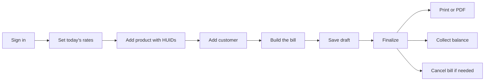

# Amman Jewellers - Billing Flow User Manual

This manual walks you through the full billing flow in JewelTrackerPro, one screen at a time:
set today's metal rates, add a product with its hallmark IDs (HUID), add a customer, build a
bill, finalize it, print it, collect the balance, and cancel it if needed.

Every step uses the **same sample shop, products, customer, and bill**, so the numbers you see
here match what the software shows. You can copy these examples the first time you practice.

> Dates are shown in the app as `9 Oct 2026` (day, 3-letter month, year). This manual uses the
> same format.

> Redeeming a Gold Savings scheme as a credit on a bill is covered in the
> [Gold Savings user manual](gold-savings-user-manual.md).

## The sample data used in this manual

| Item | Value |
| --- | --- |
| Shop | Amman Jewellers |
| Bill date | 9 Oct 2026 |
| Gold 24K rate | Rs. 7,640 / g |
| Gold 22K rate | Rs. 7,000 / g |
| Gold 20K rate | Rs. 6,370 / g |
| Gold 18K rate | Rs. 5,730 / g |
| Fine silver (999) rate | Rs. 98 / g |
| 925 silver rate | Rs. 91 / g |
| Customer | Meenakshi S, mobile 9876543210, Salem |
| Product 1 | Rope Chain - Chain, Gold 22K, gross 8.250 g, net 8.000 g, stock 2, HUIDs `AB12C3`, `AB12C4` |
| Product 2 | Lakshmi Ring - Ring, Gold 22K, gross 4.300 g, stone 0.300 g, net 4.000 g, making Rs. 1,500, stock 1, HUID `RG45T7` |

Bill built from these products (a **Tax Invoice**):

| Line | Particulars | Net wt | VA% / Making | Rate | Line total |
| --- | --- | --- | --- | --- | --- |
| 1 | Rope Chain (22K) - HUID AB12C3 | 8.000 g | VA 12% | Rs. 7,000 / g | Rs. 62,720.00 |
| 2 | Lakshmi Ring (22K) - HUID RG45T7 | 4.000 g | Making Rs. 1,500 | Rs. 7,000 / g | Rs. 29,500.00 |

| Bill totals | Amount |
| --- | --- |
| Subtotal | Rs. 92,220.00 |
| Discount | Rs. 220.00 |
| Taxable | Rs. 92,000.00 |
| CGST 1.5% | Rs. 1,380.00 |
| SGST 1.5% | Rs. 1,380.00 |
| Round off | Rs. 0.00 |
| **Amount payable** | **Rs. 94,760.00** |
| Paid by UPI | Rs. 90,000.00 |
| **Balance due** | **Rs. 4,760.00** (status: Partial) |

The bill number is `DRAFT-12` while it is a draft, and it becomes `TI-2026-0001` when you
finalize it. (A Quotation / cash bill of the same date would get `CB-2026-0001`.)

## Flow at a glance

---

## Step 0 - Sign in

1. Open JewelTrackerPro and sign in with your username and password.
2. The left sidebar is your menu: **Dashboard, Billing, Gold Savings, Inventory, Dues,
   Customers, Reports, Gold & Silver Rates, Settings** (and **Users** for administrators).

You must set today's rates before billing, so start there.

---

## Step 1 - Set today's rates

Menu: **Gold & Silver Rates**

1. Check the **date** at the top of the page. It should be 9 Oct 2026 for this sample.
2. Type today's rate per gram in each card:

   | Card | Sample rate |
   | --- | --- |
   | 24K GOLD | 7,640 |
   | 22K GOLD | 7,000 |
   | 20K GOLD | 6,370 |
   | 18K GOLD | 5,730 |
   | FINE SILVER (999) | 98 |
   | 925 SILVER | 91 |

3. Save. The new rates appear under **Recent updates**.

**Why this matters:** when you build a bill, each gold line is priced from the 22K / 20K / 18K /
24K card that matches the item's purity. If the rates are not dated for the bill date, the bill
editor shows a yellow banner: *"Rates last updated ... Update today's rates"*. Update the rates
before you bill.

---

## Step 2 - Add products with HUIDs

Menu: **Inventory > Products**, then the **Add product** button. The form has four sections.

### Product 1 - Rope Chain

**Section 1 - Product information**

| Field | Sample value |
| --- | --- |
| Product name | `Rope Chain` |
| SKU / Variant code | leave blank (optional) |
| Product image | optional (PNG or JPEG, max 2MB) |

**Section 2 - Classification**

| Field | Sample value |
| --- | --- |
| Metal | `Gold` |
| Category | `Chain` |
| Purity | `22K` |

**Section 3 - Weight & pricing**

| Field | Sample value |
| --- | --- |
| Gross weight (g) | `8.250` |
| Net weight (g) | `8.000` |
| Stone weight (g) | leave blank |
| Making charges (Rs.) | leave blank (this chain is billed on VA%) |

**Section 4 - Stock & variant**

| Field | Sample value |
| --- | --- |
| Stock quantity (pcs) | `2` |
| Size | leave blank |
| Stone details | leave blank |
| HUID (Hallmark Unique ID) | `AB12C3` and `AB12C4` |
| Active | ticked |

### Product 2 - Lakshmi Ring

**Section 1 - Product information**: Product name `Lakshmi Ring`, SKU blank.

**Section 2 - Classification**: Metal `Gold`, Category `Ring`, Purity `22K`.

**Section 3 - Weight & pricing**

| Field | Sample value |
| --- | --- |
| Gross weight (g) | `4.300` |
| Net weight (g) | `4.000` |
| Stone weight (g) | `0.300` |
| Making charges (Rs.) | `1,500` |

**Section 4 - Stock & variant**

| Field | Sample value |
| --- | --- |
| Stock quantity (pcs) | `1` |
| Size | `16` |
| Stone details | `1 ruby stone, prong set` |
| HUID (Hallmark Unique ID) | `RG45T7` |
| Active | ticked |

### HUID rules (important)

- A HUID is exactly **6 letters or digits** (for example `AB12C3`). The field accepts capital
  letters and digits only.
- You must enter **one HUID for each piece in stock**. If stock quantity is `2`, the form asks
  for two HUIDs. The helper line under the heading shows the progress, for example
  *"2 of 2 pieces tagged"*.
- HUIDs must be **unique across the whole shop**. If you type one that is already used, the form
  stops you with a message.
- If stock is `0`, no HUID is needed (*"No HUID needed while stock is 0."*). Add HUIDs when you
  bring the pieces into stock.

When both products are saved, the Products page shows Rope Chain with `2` in stock and
Lakshmi Ring with `1` in stock.

---

## Step 3 - Add the customer

You can do this from the menu (**Customers > Add customer**) or straight from a new bill
(there is a **New** button in the Customer card). Either way the same form opens.

| Field | Sample value | Notes |
| --- | --- | --- |
| Name | `Meenakshi S` | Required |
| Mobile | `9876543210` | Required |
| F / M / H Name | `Subramani` | Optional (father / mother / husband) |
| Aadhaar | `1234 5678 9012` | Optional |
| PAN | `ABCDE1234F` | Optional |
| Address | `12, Bazaar Street, Salem` | Required |
| Notes | leave blank | Optional |

Save. The customer now appears in the Customer search inside the bill editor, and the bill shows
their code, for example `CUST-0007`.

---

## Step 4 - Build the bill (Tax Invoice)

Menu: **Billing**, choose the **Tax Invoice** tab, then **New Tax Invoice**.
(The first tab, **Quotation**, is a bill without GST - see Step 10.)

### 4.1 Bill header

| Field | What to do |
| --- | --- |
| Bill Date | Confirm `9 Oct 2026` |
| Bill No. | Shows `DRAFT-...` or *"Assigned on finalize"* with the hint **at finalize** |
| Status | Starts as **Draft** |

### 4.2 Pick the customer

1. In the **Customer** card, type the name or mobile in the search box, for example `Meenak`.
2. Choose **Meenakshi S** from the list. The bill shows chips for the name, mobile, the customer
   code (`CUST-0007`), and the address.

### 4.3 Add item lines

1. In the **Items** card, type in the product search box. Search works by name, metal, category,
   SKU, or even a HUID. Search `chain`.
2. Each result shows a **stock label**:
   - `2 in stock` - both chain pieces are free,
   - `All 1 on this bill` - you have already put the only piece on the bill,
   - `Out of stock` - the option is greyed out and cannot be picked.
3. Pick **Rope Chain**. Because the piece is tagged, a **HUID dropdown** appears on the line -
   select `AB12C3`.
4. In the same way, search and add **Lakshmi Ring**, and select HUID `RG45T7`.

You can also click **Add Item** to create a blank line and type an item that is not in the
catalog (for example a loose stone).

### 4.4 Set the line detail

For each line you can edit: Particulars (name), **Purity**, **VA%** or **Making**, Stone rate,
Metal rate, and quantity.

| Line | Purity | VA% / Making | Metal rate |
| --- | --- | --- | --- |
| Rope Chain | 22K | VA `12` (%) | 7,000 |
| Lakshmi Ring | 22K | Making `1,500` (Rs.) | 7,000 |

The line amount is worked out for you. The two line totals become Rs. 62,720.00 and
Rs. 29,500.00.

### 4.5 Summary and payment (right-hand panel)

| Field | Sample value |
| --- | --- |
| Discount | `220` |
| Round off | auto (shows `0` here) |
| Tax | auto GST 3% on a Tax Invoice (CGST 1.5% + SGST 1.5%) |
| Payment mode | `UPI` |
| Amount Paid | `90,000` |

The panel then shows:

| | Amount |
| --- | --- |
| Amount Payable | Rs. 94,760.00 |
| Amount Paid | Rs. 90,000.00 |
| Balance Due | Rs. 4,760.00 |

**Payment mode tips**

- **Cash** - leaving Amount Paid blank pays the bill in full on save (the placeholder is
  *"Auto full on save"*).
- **UPI**, **Card** - entering nothing means no payment yet; type the amount received.
- **Mixed** - split the payment across modes (for example Rs. 50,000 cash + Rs. 40,000 UPI).
- Leaving a part payment creates a **balance due** that appears on the Dues page.

---

## Step 5 - Save as draft

Click **Save draft** in the top bar.

- The bill is stored with a provisional number: `DRAFT-12` (the number uses the bill's id).
- The Status stays **Draft**.
- On the Billing list the row shows **Draft** in the status column, and the number column shows
  *Draft* with the real `DRAFT-12` beside it.

You can reopen a draft any time, edit it, and it will keep the same `DRAFT-` number until you
finalize. Use **Preview** to see the bill; a draft print carries a large diagonal **DRAFT**
stamp so it is never mistaken for a final bill.

---

## Step 6 - Finalize the bill

Click **Finalize**.

Before it saves, the app checks your work and stops you with a clear message if something is
missing (a HUID on a tagged line, or a line that asks for more pieces than you have in stock).

When it succeeds, several things happen at once:

| What | Before | After |
| --- | --- | --- |
| Bill number | `DRAFT-12` | `TI-2026-0001` |
| Status | Draft | Final (Partial, because Rs. 90,000 of Rs. 94,760 is paid) |
| Rope Chain stock | 2 | 1 |
| Lakshmi Ring stock | 1 | 0 |
| HUID tags on the products | includes `AB12C3`, `RG45T7` | those two are released (sold pieces leave stock) |
| Customer details, rates | live | frozen into the bill, so later edits do not change this bill |
| Save / Finalize buttons | available | hidden (the bill is read-only) |

A **Bill finalized** dialog appears showing the number, customer, amount payable, paid, balance,
and a status chip (**PAID** / **PARTIAL** / **UNPAID**). Buttons: **Print**, **WhatsApp**,
**Download PDF**, **View Invoice**, **New Bill**.

> The bill number is assigned only at finalize. This keeps GST and cash-bill numbers gap-free
> even if a draft is abandoned.

---

## Step 7 - Print or save as PDF

From the bill (or the finalized dialog) use one of:

- **Preview / Print** - opens the print preview. In the preview you can **Print** to the default
  printer or click **PDF** to save a copy.
- **PDF** on the top bar - downloads the PDF directly, named after the bill (for example
  `TI-2026-0001.pdf`).

Paper size and copies are set per bill type in **Settings > Printers**:

| Bill type | Paper options |
| --- | --- |
| Cash bill (Quotation) | A5, A4, Thermal 80mm |
| Tax invoice | A5, A4, Thermal 80mm |

**Reprints keep the original details.** A finalized bill stores the customer name, address and
the metal rates used on the day. If you rename a product or change the rates next month, a
reprint of `TI-2026-0001` still shows the original name, rate, and customer - exactly as it was
printed on 9 Oct 2026.

To reprint the most recent bill quickly, use the reprint action on the Billing list - it opens
the same preview for the last bill that was printed.

---

## Step 8 - Collect the balance

The sample bill has Rs. 4,760 still due (status **Partial**). To collect it:

1. Open the bill and click **Record Payment** (also available from the Payment Details area).
2. Fill in:

   | Field | Sample value |
   | --- | --- |
   | Amount | `4,760` |
   | Date | 9 Oct 2026 |
   | Mode | `Cash` |
   | Note | `Balance on delivery` (optional) |

3. Save. The **Payment History** table now lists the initial UPI payment and the cash payment,
   and the status moves from **Partial** to **Paid**.

You can also collect dues without opening each bill: menu **Customer Dues** lists every
outstanding balance and today's collections, and lets you record a payment against a bill.

> Payments can only be recorded on a **finalized** bill. Drafts and quotations do not accept
> payments; finalize first.

---

## Step 9 - Cancel a bill

If a finalized bill is wrong, you can cancel it. The bill number stays used (it is never
recycled).

1. Open the finalized bill and click **Cancel bill** (the button is shown only on a final,
   non-historical bill).
2. In the **Cancel bill** dialog, review the text and the **Refund** line (the amount already
   paid - Rs. 94,760 if the bill above is fully paid). Type a **Reason** of at least 3 characters,
   for example `Wrong customer`.
3. Confirm with **Cancel bill** (or **Keep bill** to back out).

What the cancellation reverses:

| Reversed | Detail |
| --- | --- |
| Stock | Every sold piece goes back to the product (Rope Chain 1 to 2, Lakshmi Ring 0 to 1) |
| HUIDs | `AB12C3` and `RG45T7` are re-tagged on the products |
| Dues | The bill's due and payment lines are removed |
| Old gold links | Any old-gold purchase applied to this bill is released and can be used again |

After cancelling, the bill:

- shows a red **CANCELLED** banner with the date and the reason,
- prints with a large diagonal **CANCELLED** stamp,
- appears under the **Cancelled** filter on the Billing list,
- is left out of sales figures, the GST report, and stock reconciliations.

**When a bill cannot be cancelled**

| Situation | Message |
| --- | --- |
| Bill already cancelled | *This bill is already cancelled* |
| Bill is a draft or estimate | *Only a finalized bill can be cancelled* |
| Bill was recorded from the old ledger | *Bills recorded from the old ledger cannot be cancelled* |
| Bill redeemed a Gold Savings scheme | *This bill redeemed a gold savings scheme, so it cannot be cancelled* |
| The metal day is already closed | *... metal day is closed ...* |

---

## Step 10 - Quotation vs Tax Invoice

The **Billing** page has two sale tabs. Both use the same editor; the difference is GST.

| | Quotation (cash bill) | Tax Invoice |
| --- | --- | --- |
| Tab label | **Quotation** - *Quotation without GST* | **Tax Invoice** - *Sale with GST (CGST/SGST/IGST)* |
| GST | None | 3% (CGST 1.5% + SGST 1.5%), or IGST if enabled |
| Number series | `CB-2026-0001` | `TI-2026-0001` |
| Sample total for the same two lines | Rs. 92,000.00 (Rs. 92,220 subtotal - Rs. 220 discount) | Rs. 94,760.00 (adds Rs. 2,760 GST) |

There is also an **Adagu Bill** tab for pledge / loan receipts, and a **Record old bill** option
in the New-bill menu for entering a bill from your old ledger (it keeps the original number and
date and does not change stock).

---

## Step 11 - Old gold purchase, payout and refiner lot

Menu: **Inventory > Old Gold Purchase**. Buying old gold from a customer is a document of its
own, separate from an exchange line on a bill.

1. Set the buying rates first on **Gold & Silver Rates → Old gold buying rates**. A rate left at
   `0` falls back to the selling rate.
2. Click **New purchase**, pick the customer, and add each lot:

   | Field | Sample value |
   | --- | --- |
   | Description | `Old chain` |
   | Gross weight (g) | `11.000` |
   | Net weight (g) | `10.000` |
   | Purity | `22K` |
   | Touch % | `80` (optional - values the fine weight, here 8.000 g) |
   | Rate / g | the 22K buying rate (or the selling rate if unset) |
   | Deduction % | `0` |

3. **Finalize**. The purchase number is `OGP-<year>-<seq>` and its full value becomes its
   **balance**.

### Apply old gold to a bill, or pay it out

The balance is drawn down by two things, in any mix:

- **Apply to a bill.** In the bill editor open the old-gold linker. Every finalized purchase for
  that customer with a balance is listed with an **Apply** action. The amount defaults to the
  smaller of the balance and the amount still payable, and can be edited down - the bill applies
  only what it needs, and the rest stays on the purchase. A warning appears if the purchase
  belongs to a different customer than the bill.
- **Pay out.** From the Old Gold Purchase list click the wallet action, or use **Pay out balance**
  in the linker. A cash payout of Rs. 10,000 or more in a day shows the section 40A(3) warning.
  A payout can be voided later with a reason, which returns the amount to the balance.

Cancelling a finalized bill releases the old gold it used, restoring the balance.

### The old gold lot and refiner batches

Menu: **Inventory > Old Gold Lot**. It lists every finalized purchase item that no sale bill has
claimed, grouped by metal.

1. Tick the items of one metal (or **Select all Gold / Silver**) and click **Create refiner
   batch**. The batch number is `OGB-<year>-<seq>`.
2. Move the batch through its steps: **Melt** (melt date and melted weight), **Send** (sent date
   and sent weight), then **Settle** (fine weight received, fine rate, cash received and mode).
3. The settled row shows **Gain / loss** = cash received + fine weight received × fine rate −
   cost. Received fine weight is settlement only and never adds to the Gold & Silver stock.
4. A batch can be **cancelled** before it is settled; its items go back to the lot.

A purchase cannot be cancelled while one of its items is in a batch.

---

## Common messages and what to do

| Message | What it means | What to do |
| --- | --- | --- |
| *Pick a HUID for &lt;item&gt;* | A tagged product line has no HUID selected | Choose a HUID in the line's dropdown |
| *Insufficient stock for &lt;item&gt; (n available, m on this bill)* | A line asks for more pieces than are in stock | Reduce the quantity, or add stock / inward first |
| *Insufficient stock* (on save) | Same problem caught by the server | Same fix as above |
| *HUID must be 6 letters or digits* | The HUID is the wrong length or has symbols | Enter exactly 6 letters/digits |
| *Add one HUID for each piece in stock* | Stock quantity and HUID count differ | Add or remove HUIDs to match the quantity |
| *HUID &lt;code&gt; is already used by &lt;product&gt;* | The HUID is tagged on another product | Use the correct HUID for this piece |
| *Rates last updated ...* banner | Today's rates are missing for the bill date | Update rates on the Gold & Silver Rates page |
| *Only a draft invoice can be modified* | You tried to edit a finalized bill | Cancel the bill, or create a new one |
| *Only a finalized bill can be cancelled* | You tried to cancel a draft / estimate | Finalize it first, or just delete the draft |
| *Payments can only be recorded on finalized invoices* | You tried to pay a draft | Finalize the bill first |
| *Payment cannot exceed the balance due* | The amount is larger than what is owed | Enter the balance or less |
| *Enter a reason for cancelling this bill* | The cancel reason is empty or too short | Type at least 3 characters |
| *Payout cannot exceed the balance of ... on OGP-...* | The old-gold payout is larger than the amount left | Enter the balance or less |
| *... is already applied to another sale bill* | That old-gold purchase has no balance left | Use a purchase that still has a balance |
| *This purchase is applied to a sale bill. Cancel that bill first.* | You tried to cancel a claimed old-gold purchase | Cancel the sale bill, or void its payout |
| *This purchase has items in a refiner batch.* | You tried to cancel a purchase whose items are batched | Cancel the refiner batch first |

---

## Quick reference

### Bill statuses

| Status | Meaning |
| --- | --- |
| **Draft** | Saved, not yet finalized. Number is `DRAFT-<id>`. Editable. No payments. |
| **Estimate** | A bill kept as an estimate rather than a final sale. Number is `EST-<year>-<seq>`. Cannot be finalized or paid. |
| **Unpaid** | Finalized with nothing paid. |
| **Partial** | Finalized with some payment; a balance is due. |
| **Paid** | Finalized and fully paid. |
| **Cancelled** | A finalized bill that was reversed. Number stays used. |

### Number formats

| Type | Format | Example |
| --- | --- | --- |
| Quotation (cash bill) | `CB-<year>-<seq>` | `CB-2026-0001` |
| Tax invoice | `TI-<year>-<seq>` | `TI-2026-0001` |
| Draft | `DRAFT-<id>` | `DRAFT-12` |
| Estimate | `EST-<year>-<seq>` | `EST-2026-0001` |

### Keys to remember

- Set today's rates first, then bill.
- One HUID per piece, 6 characters, never reused.
- A bill number is born at **finalize** - drafts carry a `DRAFT-` placeholder.
- Stock and HUIDs move only at finalize, and move back if you cancel.
- Reprints always show the original customer and rates, even after later changes.
