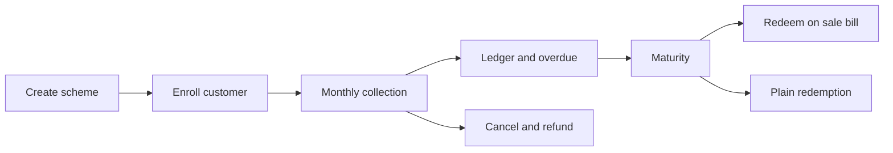

# Amman Jewellers - Gold Savings User Manual

This manual walks you through the whole **Gold Savings** module in JewelTrackerPro, one screen
at a time: set today's rate, create a monthly scheme, enroll a customer, collect the monthly
installments, watch the gold accumulate, follow up on overdue installments, then redeem, or
cancel and refund.

Every step uses the **same sample shop, scheme, customer, and account**, so the numbers you see
here match what the software shows. You can copy these examples the first time you practice.

> Dates are shown in the app as `9 Oct 2026` (day, 3-letter month, year). This manual uses the
> same format. Gold weights are shown to three decimals (milligrams).

> The **sale bill** side of a redemption (building the bill, GST, printing) is covered in the
> [Billing flow user manual](billing-user-manual.md). This manual only covers the scheme end.

## The sample data used in this manual

**Shop and rates** (the same shop as the billing manual):

| Item | Value |
| --- | --- |
| Shop | Amman Jewellers |
| 22K gold rate, 9 Oct 2026 | Rs. 7,000 / g |
| 22K gold rate, 9 Nov 2026 | Rs. 7,140 / g |
| 22K gold rate, 21 Dec 2026 | Rs. 7,200 / g |
| 22K gold rate, 9 Aug 2027 (maturity) | Rs. 7,500 / g |

**The scheme:**

| Field | Sample value |
| --- | --- |
| Code | `GS-001` (assigned automatically) |
| Name | Swarna Sembu 11 |
| Monthly installment | Rs. 7,000 |
| Duration | 11 months |
| Purity | 22K |
| Gold rate source | Existing rate configuration |
| Bonus | Additional gold weight, `0.500` g, "Pay all 11 installments" |
| Grace period | 7 days |
| Late fee | Amount per day late, Rs. 10 |
| Cancellation deduction | 5% of amount paid |
| Early closure / partial redemption / multiple accounts | Off |

**The customer and the account:**

| Field | Sample value |
| --- | --- |
| Customer | Meenakshi S, mobile 9876543210, Salem |
| Nominee | Subramani (Husband), mobile 9865000011 |
| Account | `GS-202610-0001` |
| Enrolled / first installment | 9 Oct 2026 |
| Expected maturity | 9 Aug 2027 (first installment + 10 months) |

**The three collections in this walkthrough:**

| Inst. | Due | Paid on | Amount | Rate | Gold credited | Late fee | Receipt |
| --- | --- | --- | --- | --- | --- | --- | --- |
| 1 | 9 Oct 2026 | 9 Oct 2026 | Rs. 7,000 | Rs. 7,000 | 1.000 g | - | `GSR-2026-0001` |
| 2 | 9 Nov 2026 | 9 Nov 2026 | Rs. 7,000 | Rs. 7,140 | 0.980 g | - | `GSR-2026-0002` |
| 3 | 9 Dec 2026 | 21 Dec 2026 | Rs. 7,000 | Rs. 7,200 | 0.972 g | Rs. 50 | `GSR-2026-0003` |

Accumulated gold after three installments: **2.952 g** (1.000 + 0.980 + 0.972).

**Maturity and redemption** (for the worked examples later):

| Item | Value |
| --- | --- |
| All 11 installments paid, accumulated gold | 10.800 g |
| Bonus earned (pay all 11) | 0.500 g |
| Total eligible gold | 11.300 g |
| Redeemed on a sale bill at Rs. 7,500 / g | Rs. 84,750 credit |

## Flow at a glance

---

## 1. Overview

Gold Savings is a **monthly deposit scheme**: the customer pays a fixed rupee amount every
month, and each installment buys gold at that day's gold rate. The gold accumulates in grams in
the account's ledger. At the end the customer can take the gold as plain gold, take it as
jewellery, or apply its value as a credit on a sale bill.

Menu path: **Gold Savings** in the left sidebar. The module has nine tabs:

| Tab | What it is for |
| --- | --- |
| **Dashboard** | KPIs, this month's collection progress, overdue aging and maturity pipeline |
| **Schemes** | Create, edit, activate and deactivate schemes (admin) |
| **Enroll** | Open a scheme account for a customer and collect the first installment |
| **Accounts** | Search every scheme account and open its full detail |
| **Collections** | Search an account and collect the next installment |
| **Ledger** | One account's gold ledger, with export and passbook print |
| **Maturity** | Redeem on a sale bill, or process a plain redemption |
| **Overdue** | Unpaid installments grouped by how long they are overdue, with a call list |
| **Reports** | Twelve collection, accumulation and redemption reports with CSV export |

### Who can do what

Most everyday work is open to all signed-in users. A few actions are **administrator only**:

| Action | Staff | Admin |
| --- | --- | --- |
| Create / edit / activate / deactivate a scheme | No | Yes |
| Enroll a customer, collect an installment | Yes | Yes |
| Confirm a rate whose date does not match | No (blocked) | Yes |
| Apply a collection discount | No | Yes |
| Reduce the late fee below the computed amount | No | Yes |
| Use a manual gold rate (schemes that allow it) | No | Yes |
| Waive an installment | No | Yes |
| Reverse a payment | No | Yes |
| Cancel the account and record the refund | No | Yes |
| Override the cancellation deduction | No | Yes |

---

## 2. Before you start - set today's gold rate

Menu: **Gold & Silver Rates**

Gold Savings always values an installment using the **22K / 24K / 18K card that matches the
scheme's purity**. So before you enroll or collect, make sure the rate is set.

1. Check the **date** at the top of the page.
2. Type the 22K gold rate per gram (Rs. `7,000` for this sample).
3. Save.

### The rate-date rule (important)

A rate has an **effective date**. When a screen needs the rate for a date, the app uses:

- the rate saved **exactly on that date** if there is one, otherwise
- the **latest rate on or before** that date (falling back to the newest rate overall).

Whenever the rate that applies is **not** dated on the requested date, the app flags it:

| Who you are | What you see |
| --- | --- |
| Anyone | `Rate Rs. 7,000 / g, set on 9 Oct 2026` |
| Staff, when the date does not match | A red banner: *"No gold rate is saved for 21 Dec 2026. Ask an administrator to set it on the rates page."* (the words *rates page* are a link). Collection and enrollment are **blocked**. |
| Admin, when the date does not match | A tick box: *"No rate is saved for 21 Dec 2026. The rate above is from 9 Dec 2026 — confirm to use it."* Tick it to continue. |

If the admin does not tick the box, or staff try to force it, the server stops them with:

| Message | When |
| --- | --- |
| *No gold rate is saved for `<date>`. The rate in use is from `<eff>`; ask an administrator to confirm it.* | Staff, rate-date mismatch |
| *No gold rate is saved for `<date>`. The rate in use is from `<eff>`. Confirm the rate date to continue.* | Admin, box not ticked |
| *No gold rate is configured. Set the rate before continuing.* | No rate exists at all |
| *Configured gold rate must be greater than zero* | The card is saved as 0 |

> Keep the rate current. If today's rate is not saved, a normal collection is blocked until an
> administrator either sets the rate or confirms the older one.

---

## 3. Step 1 - Create a scheme

Menu: **Gold Savings > Schemes**, then **New scheme** (administrator only).

The modal is titled **New scheme**; when you edit an existing one it is **Edit GS-001**. Fill in:

| Field | Sample value | Notes |
| --- | --- | --- |
| Scheme name | `Swarna Sembu 11` | Required |
| Duration (months) | `11` | Minimum 1 |
| Description | `11-month 22K gold savings plan` | Optional |
| Monthly installment | `7,000` | Minimum 1 |
| Minimum installment | blank | If set, the lowest collection allowed |
| Maximum installment | blank | If set, the highest collection allowed |
| Gold purity | `22K` | 24K / 22K / 18K |
| Gold rate source | `Existing rate configuration` | Or **Allow manual entry (admin)** |
| Gold rate unit | `₹ per gram` | Read-only |
| Bonus type | `Additional gold weight` | None / Fixed amount / Percentage / Additional gold weight |
| Bonus value | `0.5` | Meaning depends on the type (see below) |
| Bonus eligibility rules | `Pay all 11 installments` | Free text, shown to staff |
| Redemption type | `Jewellery purchase` | Gold / Jewellery purchase / Configurable |
| Grace period (days) | `7` | Days after the due date before a late fee starts |
| Cancellation deduction | `Percentage of amount paid` | No deduction / Percentage of amount paid / Fixed amount |
| Deduction (%) | `5` | Label switches to `Deduction (₹)` for a fixed deduction |
| Late fee | `Amount per day late` | No late fee / Fixed amount once late / Amount per day late |
| Late fee (₹ / day) | `10` | Label switches to `Late fee (₹)` for a fixed fee |
| Making charge rules | `No making charges on scheme redemption` | Free text |
| Wastage rules | `Nil` | Free text |
| Available from / Available to | blank | Optional window during which enrollment is allowed |
| Terms and conditions | `Gold is valued at the rate on the day of each installment. Gold is delivered only at maturity.` | Shown on the Enroll screen |

The five check boxes at the bottom:

| Check box | Sample | Effect |
| --- | --- | --- |
| Allow late payments | **ticked** | If off, a payment after the grace period is rejected |
| Allow missed installments | unticked | If off, installments must be collected in order |
| Allow early closure | unticked | If off, the account cannot be closed before maturity (unless it is a full redemption) |
| Allow partial redemption | unticked | If off, a redemption must take the full eligible balance |
| Allow multiple accounts per customer | unticked | If off, one active/matured account per customer per scheme |

Click **Save scheme**. The scheme is created with an automatic code in the form `GS-001`,
`GS-002`, and so on, and a toast reads *Scheme created*.

### Activate / deactivate

On the Schemes list each row has **Edit** and **Deactivate** (or **Activate**). Deactivating
asks *"Change Swarna Sembu 11 to inactive? Existing accounts are not deleted."* and shows
*Scheme deactivated*. An inactive scheme:

- cannot be chosen for a new enrollment (*"Cannot enroll into an inactive scheme"*),
- is hidden from the Enroll scheme list,
- leaves every existing account running normally.

### Scheme rules that matter later

- **Enrollment window.** If **Available from** is set and the enrollment date is earlier, the app
  says *"This scheme is not yet available"*. If **Available to** is set and the date is later:
  *"This scheme is no longer available"*.
- **Minimum / maximum installment.** If set, they are checked at enrollment and at every
  collection (below).
- **Grace and late fee.** Used to compute the late fee on a collection (Step 3).
- **Bonus.** Applied only at redemption, and only once (Steps 8 and 9).

---

## 4. Step 2 - Enroll a customer

Menu: **Gold Savings > Enroll**.

The page has three parts: Customer information, Scheme information, and an **Initial payment**
panel on the right.

### 4.1 Customer information

1. In **Scheme account / customer search**, type the name, mobile, customer ID, or code
   (`Meenak`). Pick **Meenakshi S** from the list. Existing customers can be reused; the
   **New** action inside the search creates one without leaving the page.
2. Fill in the nominee:

   | Field | Sample value |
   | --- | --- |
   | Nominee name | `Subramani` |
   | Nominee relationship | `Husband` |
   | Nominee mobile | `9865000011` (10 digits only; non-digits are stripped as you type) |

### 4.2 Scheme information

| Field | Sample value | Notes |
| --- | --- | --- |
| Scheme | `Swarna Sembu 11 (GS-001)` | Only active schemes are listed |
| Monthly installment | `7,000` | Defaults to the scheme's monthly amount |
| Enrollment date | 9 Oct 2026 | |
| First installment date | 9 Oct 2026 | Drives the schedule |
| Expected maturity | 9 Aug 2027 | Read-only; first installment + (duration - 1) months |
| Preferred payment day | `9` | 1 to 28, optional |
| Gold purity | `22K` | Read-only, from the scheme |
| Duration | `11 months` | Read-only, from the scheme |

The scheme's **Terms and conditions** text is shown here. Tick
**"I confirm the customer has accepted the scheme terms"** - the **Create scheme account**
button stays disabled until you do.

### 4.3 Initial payment (right panel)

**Collect first installment now** is ticked by default. Fill in:

| Field | Sample value |
| --- | --- |
| Amount | `7,000` |
| Payment mode | `Cash` (Cash / UPI / Card / Bank Transfer / Other) |
| Transaction reference | blank |

The **Gold weight credited** preview shows `7,000 ÷ 7,000 per g = 1.000 g`, and the line below
reads *"This installment: 1.000 g"*. The rate notice appears here too (Step 2).

> If you untick **Collect first installment now**, the account is created with no payment; the
> first installment stays due and you collect it later from **Collections**.

### 4.4 Confirm

Click **Create scheme account**. The confirm dialog reads *"Enroll Meenakshi S in Swarna Sembu
11 at Rs. 7,000 / month?"*. Click **Enroll**.

When it succeeds:

| What happens | Result |
| --- | --- |
| Toast | *Customer enrolled* |
| Account number | `GS-202610-0001` (`GS-<YYYYMM>-<seq>`) |
| Installment schedule | 11 rows; due dates 9 Oct 2026 through 9 Aug 2027 |
| Installment 1 | Paid (receipt `GSR-2026-0001`) |
| Gold ledger | One row: +1.000 g |
| Receipt | An **Enrollment receipt** print preview opens (passbook) |

Close the preview; the app takes you to the new account's detail page.

### 4.5 Enrollment rules

| Situation | Message |
| --- | --- |
| Scheme is inactive | *Cannot enroll into an inactive scheme* |
| Enrollment before **Available from** | *This scheme is not yet available* |
| Enrollment after **Available to** | *This scheme is no longer available* |
| Customer / scheme not found | *Customer not found* / *Scheme not found* |
| Monthly installment below the scheme minimum | *Monthly installment is below the scheme minimum* |
| Monthly installment above the scheme maximum | *Monthly installment exceeds the scheme maximum* |
| Customer already has an active/matured account and multiple accounts are off | *Customer already has an active account in this scheme* |

---

## 5. Step 3 - Collect a monthly installment

Menu: **Gold Savings > Collections**.

The page lists every **active** account that still has a due date, sorted by the next due date.
Click a row to select it (double-click or press **Enter** to open the collect modal straight
away), then click **Collect next installment** in the top bar. Six stat cards show the selected
account's monthly amount, paid/total, amount paid, gold accumulated, next due, and status.

The modal is titled **Collect GS-202610-0001**. Its header line reads
*"Meenakshi S · next due 9 Nov 2026 · accumulated 1.000 g"*.

### 5.1 The collect modal fields

| Field | Sample (installment 2) | Notes |
| --- | --- | --- |
| Installment | `#2` (read-only) | The next unpaid installment, or `#2 + 1 more` for a batch |
| Installments to collect | `1` | A stepper (1 to the number of unpaid installments) |
| Payment date | 9 Nov 2026 | |
| Amount (or Amount per installment) | `7,000` | Defaults to the scheme monthly amount |
| Late fee | `0` | Read-only for staff and for batches; admin-editable on a single installment |
| Discount | blank (admin only) | Label reads `Discount (first installment)` for a batch |
| Total received | `Rs. 7,000` | Read-only: amount × count + late fee − discount |
| Manual rate / Override reason | hidden | Shown only for a scheme that allows manual rates, and only to an admin |
| Payment mode | `Cash` | Cash / UPI / Card / Bank Transfer / Other |
| Transaction reference | blank | |
| Remarks | blank | |

Two live previews change as you type:

- **Gold weight credited** - `Rs. 7,000 ÷ Rs. 7,140 per g` gives **0.980 g**, with the running
  line *"This installment 0.980 g · total so far 1.000 g"*.
- For a batch, an **Installments in this receipt** table with one row per installment
  (Inst. / Due / Amount / Late fee / Gold), plus a summary of the total.

### 5.2 Worked example - installment 2

1. Select `GS-202610-0001`, click **Collect next installment**.
2. Confirm **Payment date 9 Nov 2026**, **Amount 7,000**, **Late fee 0**.
3. **Record payment** → confirm *"Receive Rs. 7,000 and credit 0.980 g at Rs. 7,140 / g?"* →
   **Confirm**.

Result: toast *Payment recorded*; receipt `GSR-2026-0002`; gold **+0.980 g**; cumulative
**1.980 g**; a **Collection receipt** print preview opens. Installment 2 leaves the Collections
list, which now shows **Next due 9 Dec 2026**.

### 5.3 Worked example - installment 3 (late, with late fee)

Installment 3 is due 9 Dec 2026 but is paid on 21 Dec 2026.

1. Select the account and open the collect modal.
2. Set **Payment date** to 21 Dec 2026.

   The late fee fills in automatically. The calculation is:

   | Step | Value |
   | --- | --- |
   | Days from due date (9 Dec) to payment date (21 Dec) | 12 days |
   | Minus the scheme grace period | − 7 days |
   | Days actually late | 5 days |
   | Late fee at Rs. 10 / day | **Rs. 50** |

   The helper text under the field reads *"10 / day after 7 grace days"*.

3. **Amount** stays `7,000`. **Total received** shows **Rs. 7,050**.
4. **Record payment** → confirm *"Receive Rs. 7,050 and credit 0.972 g at Rs. 7,200 / g?"*.

Result: receipt `GSR-2026-0003`; gold **+0.972 g**; cumulative **2.952 g**. Notice that the
**late fee does not buy gold** - only the Rs. 7,000 installment amount is converted.

### 5.4 Catching up several installments at once

If more than one installment is due, **Installments to collect** defaults to the number of
**overdue** installments. Increase or decrease it with the **+ / −** stepper. The receipt table
then lists each installment with its own late fee, and the confirm text switches to
*"Receive Rs. X for N installments and credit Y g at Rs. Z / g?"*. The whole batch is stored as
one receipt with a shared batch number (`GSB-<year>-<seq>` internally).

### 5.5 Collection rules

| Situation | Message |
| --- | --- |
| Trying to pay a later installment before the next one, when missed installments are off | *Collect the next unpaid installment before skipping ahead* |
| Amount below the scheme minimum | *Installment amount is below the scheme minimum* |
| Amount above the scheme maximum | *Installment amount exceeds the scheme maximum* |
| Payment after grace when late payments are off | *Late payments are not allowed for this scheme* |
| Staff lowers the late fee | *Only administrators can reduce the late fee* |
| Staff adds a discount | *Only administrators can apply a collection discount* |
| Manual rate on a scheme that does not allow it | *Manual gold rates are not allowed for this scheme* |
| Non-admin tries a manual rate | *Permission denied to override the gold rate* |
| Manual rate without a reason | *A reason is required when overriding the gold rate* |
| No unpaid installment remains | *No eligible installment remains on this account* |
| Batch asks for more than remain | *Only N installment(s) remain on this account* |
| Account is cancelled/redeemed/closed | *Payments cannot be recorded on a closed scheme account* |
| Total works out to zero or less | *Total amount received must be greater than zero* |

> Only an administrator can lower the late fee, add a discount, or use a manual rate. The late
> fee field is disabled for staff and when collecting a batch.

---

## 6. Step 4 - Account detail

Menu: **Gold Savings > Accounts**, then click the account number (or open it from the search on
the Ledger or Maturity tab).

### 6.1 Header and stat cards

The page header shows `GS-202610-0001` with *"Meenakshi S · Swarna Sembu 11"* and these actions:

| Action | Shown when |
| --- | --- |
| **Accounts** (back) | Always |
| **Print passbook** | Always (`/print/gs-passbook/<id>`) |
| **Collect payment** | Account is **active** |
| **Cancel** | Administrator, and the account is **active** or **matured** |

After three installments the four cards read:

| Card | Value |
| --- | --- |
| Total scheme value | Rs. 77,000 (`7,000 × 11`) |
| Amount collected | Rs. 21,000 |
| Gold accumulated | 2.952 g |
| Installments paid | `3 / 11` |

### 6.2 The six sub-tabs

| Sub-tab | What it shows |
| --- | --- |
| **Overview** | Progress bars, account snapshot, bonus projection, account details |
| **Installments** | All 11 rows with status, and the admin **Waive** action |
| **Payments** | Every receipt with amount, rate, gold, mode, status, **Reprint**, admin **Reverse** |
| **Gold ledger** | Date, type, reference, gold, cumulative |
| **Maturity** | Maturity date, accumulated gold, **Open maturity** link, redemption history |
| **Audit** | A timestamped log of every change to the account |

### 6.3 Overview in detail

- **Scheme progress** bars: *Installments 3 / 11* (27%) and *Amount Rs. 21,000 / Rs. 77,000* (27%).
- **Account snapshot**:
  - Remaining installments: **8**
  - Remaining amount: **Rs. 56,000**
  - Projected gold at maturity: with today's 22K rate Rs. 7,200, the remaining eight
    installments add eight lots of 0.972 g (7.776 g) to the 2.952 g held, so **10.728 g**.
  - Days to maturity: from today to 9 Aug 2027.
- **Bonus projection**:
  - Current bonus: **Not yet eligible**
  - If completed: **0.500 g**
  - The condition line: *"Pay all 11 installments · 8 installments remaining."*

### 6.4 Installments sub-tab

Rows are `01` to `11` with due date, amount, and a status chip (**Upcoming**, **Due**,
**Overdue**, **Paid**, **Waived**). For an administrator, every not-yet-paid and not-yet-waived
row has a **Waive** button (Step 5).

### 6.5 Payments sub-tab

Columns: **Receipt**, **Date**, **Inst.**, **Amount**, **Rate**, **Gold**, **Mode**, **Status**.
Each row has **Reprint** (opens the passbook). An administrator also sees **Reverse** on a
**posted** payment while the account has not been redeemed.

### 6.6 Gold ledger sub-tab

The transaction-level ledger for this account: **Date**, **Type**, **Ref**, **Gold**,
**Cumulative**. Types are `payment`, `reversal`, `bonus`, `redemption` and `refund`. After the
three collections it reads:

| Date | Type | Ref | Gold | Cumulative |
| --- | --- | --- | --- | --- |
| 9 Oct 2026 | payment | `GSR-2026-0001` | +1.000 g | 1.000 g |
| 9 Nov 2026 | payment | `GSR-2026-0002` | +0.980 g | 1.980 g |
| 21 Dec 2026 | payment | `GSR-2026-0003` | +0.972 g | 2.952 g |

---

## 7. Step 5 - Corrections (administrator)

Two corrections are available, both requiring a reason.

### 7.1 Reverse a payment

Open **Account > Payments**, click **Reverse** on a posted payment, and read the dialog:

> *"Reversing restores the installment and deducts the credited gold from the ledger. Physical
> stock is unchanged."*

Fill in a **Reason** (for example `Cheque bounced`) and click **Reverse payment**.

| Effect | Detail |
| --- | --- |
| Payment status | `reversed` |
| Installment | back to **Due** |
| Gold ledger | a `reversal` row, `-<gold>` grams, reference `<receipt>-REV` |
| Stock | unchanged |

Reversal is not allowed when the account was redeemed or is closed, and a reason is required
(the UI shows *Reason is required* if the box is empty). Server messages: *This payment is
already reversed*, *Cannot reverse a payment on a closed scheme account*, *Cannot reverse a
payment after the account has been redeemed*.

### 7.2 Waive an installment

Open **Account > Installments** and click **Waive** on an unpaid row. The dialog says:

> *"Waiving marks the installment as settled without a payment. Accumulated gold is unchanged,
> and the bonus still needs every installment paid."*

Fill in a **Reason** and click **Waive installment**. The installment status becomes **Waived**.

> **Watch the bonus.** A waived installment counts toward **maturity** (paid + waived), but the
> bonus is granted only when **every** installment has status **Paid**. So a scheme with a
> waived installment will not earn its bonus.

Server messages: *Only administrators can waive an installment*, *This installment is already
paid*, *This installment is already waived*, *This scheme account cannot be modified*.

---

## 8. Step 6 - Scheme ledger

Menu: **Gold Savings > Ledger**.

1. Search and pick an account in **Scheme account**.
2. Narrow it down with:
   - **From** / **To** date pickers,
   - the status filter: **All**, **Payment**, **Reversal**, **Bonus**, **Redemption**, **Posted**,
   - the receipt search box.
3. Use **Export** to download a CSV named `<accountNo>.csv`, or **Print passbook**.

Columns: **Month / Inst.**, **Date**, **Receipt**, **Amount**, **Gold rate**, **Gold weight**,
**Cumulative**, **Mode**, **Status**.

> The ledger is the **source of truth** for accumulated gold. The account's "Gold accumulated"
> figure is simply the running total of the ledger.

---

## 9. Step 7 - Overdue and the call list

Menu: **Gold Savings > Overdue**.

Every unpaid installment past its due date is grouped into aging buckets:

| Bucket | Meaning |
| --- | --- |
| 1-7 days | Newly overdue |
| 8-15 days | Follow up |
| 16-30 days | Escalate |
| 30+ days | Urgent |
| All | Everything |

Use the **Scheme** filter and the search box to narrow the list. Three stat cards summarise the
selection: **Overdue installments**, **Accounts affected**, and **Amount at risk**.

Each row has the account, customer, mobile, scheme, installment number, due date, days overdue,
amount, and a **Remind** button that opens WhatsApp with a ready-made message (shop name,
customer, account, installment, due date, amount). Clicking the account number opens the
account.

Top-bar actions:

| Action | Result |
| --- | --- |
| **Print call list** | Opens `/print/gs-call-list` with the current bucket / scheme / search |
| **Export CSV** | Downloads `overdue-aging.csv` for the visible rows |

---

## 10. Step 8 - Maturity

Menu: **Gold Savings > Maturity**, then search and select the account.

### 10.1 When is an account matured?

The account status becomes **Matured** as soon as **either**:

- every installment is **Paid** or **Waived**, **or**
- today's date reaches the **maturity date**.

> Maturity by date does **not** mean the bonus is payable. The bonus still requires **all
> installments paid**.

### 10.2 The maturity screen

Four cards:

| Card | On a fully paid account |
| --- | --- |
| Amount paid | Rs. 77,000 |
| Accumulated gold | 10.800 g |
| Applicable bonus | 0.500 g (or **Not yet eligible** / **None**) |
| Total eligible gold | **11.300 g** |

Below the cards:

- **Redeem on a sale bill** - Step 9a,
- **Process plain redemption** - Step 9b.

### 10.3 The bonus rule

The bonus comes from the scheme configuration and is applied **at most once** per account:

| Bonus type | How the grams are worked out |
| --- | --- |
| Additional gold weight | The fixed value, e.g. `0.500 g` |
| Percentage | Accumulated grams × value ÷ 100, e.g. 10.800 g × 5% = **0.540 g** |
| Fixed amount | Rs. value ÷ the latest gold rate, e.g. Rs. 4,000 ÷ Rs. 8,000 = **0.500 g** |
| None | No bonus |

In this sample the scheme gives **0.500 g** as additional gold weight, giving
10.800 + 0.500 = **11.300 g** eligible.

> Once a `bonus` row appears in the ledger, later redemptions of the same account do not grant
> the bonus again.

---

## 11. Step 9a - Redeem on a sale bill

On the Maturity screen, click **Redeem on a sale bill**. This opens a new **Quotation** at
`/billing/cash/new` with this customer already selected. (It is a cash bill / Quotation, so
there is no GST - build a Tax Invoice instead if you need one; the scheme credit works the
same way.)

### 11.1 Apply the scheme on the bill

On the bill editor, a **Gold Savings** card lists the customer's redeemable accounts:

| Account | Gold | Rate | Credit | Apply |
| --- | --- | --- | --- | --- |
| `GS-202610-0001 · Swarna Sembu 11` | 11.300 g *(incl. 0.500 g bonus)* | Rs. 7,500 | Rs. 84,750 | **Apply** |

Click **Apply** to attach the account; the row's Apply button becomes a remove button.

### 11.2 How the credit is worked out

> **Credit = eligible grams × the bill's gold rate.**
> `11.300 g × Rs. 7,500 = Rs. 84,750`

The credit is applied against the bill's grand total, alongside old gold, **before rounding**.
So for a bill whose invoice total is Rs. 1,02,000:

| Bill | Amount |
| --- | --- |
| Invoice total | Rs. 1,02,000 |
| Gold Savings credit | − Rs. 84,750 |
| **Amount payable** | **Rs. 17,250** |

### 11.3 Finalize

The redemption is created **only when the bill is finalized** - the draft just holds the link.
At that moment the app:

- re-checks the account balance (if it changed, it stops with *"`<account>` balance changed;
  re-save this bill before finalizing"*),
- creates a redemption receipt `GSRD-<year>-<seq>`,
- writes the `bonus` and `redemption` rows to the ledger,
- sets the account to **Redeemed** if the whole balance was used.

> **A bill that redeemed a scheme cannot be cancelled.** *"This bill redeemed a gold savings
> scheme, so it cannot be cancelled"*. Plan the bill carefully before finalizing.

### 11.4 If the credit is larger than the bill

If the full credit would make the payable negative, the app uses only what the bill can absorb
(**partial redemption**) - but only when the scheme allows partial redemption. Otherwise:

| Situation | Message |
| --- | --- |
| Account belongs to a different customer | *This scheme account does not belong to the bill customer* |
| Account cancelled/redeemed | *`<account>` cannot be redeemed* |
| Account already on another bill | *`<account>` is already applied to another bill* |
| Credit exceeds the bill and partial is off | *`<account>` value exceeds the bill; add items or allow partial redemption* |
| Partial use when early closure is off | *Early closure is not allowed for `<account>`* |

> For a **Quotation vs Tax Invoice** reminder, the billing numbers, and how to print the bill,
> see the [Billing flow user manual](billing-user-manual.md).

---

## 12. Step 9b - Plain redemption

On the Maturity screen, use the **Process plain redemption** card. Accumulated gold is the
customer's credited weight from the ledger; any bonus is added only when the scheme's
eligibility is met.

| Field | Sample value | Notes |
| --- | --- | --- |
| Redemption date | 9 Aug 2027 | |
| Option | `Redeem as jewellery` | Other choice: `Redeem gold weight` |
| Gold weight (blank = full eligible) | blank | Leave blank to redeem the whole eligible balance |

Click **Process redemption** and confirm:

> *"Record this redemption against the scheme ledger? Physical inventory will not change."*

Click **Redeem**. The app records a redemption with receipt `GSRD-<year>-<seq>`, writes the
`bonus` (if any) and `redemption` rows to the ledger, and shows the redemption history on the
Maturity sub-tab. A **full** redemption sets the account status to **Redeemed**; a partial one
leaves it active.

> A plain redemption **does not change stock**. It records the gold leaving the scheme, not a
> physical issue from Inventory.

| Situation | Message |
| --- | --- |
| Account cancelled/redeemed/closed | *This scheme account cannot be redeemed* |
| Nothing accumulated | *No accumulated gold is available to redeem* |
| Weight typed is more than eligible | *Requested gold weight exceeds the eligible balance* |
| Partial weight when partial is off | *Partial redemption is not allowed for this scheme* |
| Partial when early closure is off | *Early closure is not allowed for this scheme* |

---

## 13. Step 10 - Cancel and refund (administrator)

Open the account, click **Cancel** (administrator only, on an active or matured account).

The **Cancel scheme account** dialog shows a live preview and these fields:

| Field | Sample value | Notes |
| --- | --- | --- |
| Reason | `Customer requested closure` | Required |
| Refund date | 21 Dec 2026 | |
| Payment mode | `Cash` | Cash / UPI / Card / Bank Transfer / Other |
| Transaction reference | blank | |
| Deduction override (Rs., optional) | blank | Placeholder shows the scheme default |

Preview (for a second account, `GS-202610-0002`, with three installments paid):

| Row | Value |
| --- | --- |
| Total paid | Rs. 21,000 |
| Deduction | Rs. 1,050 (5% of Rs. 21,000) |
| Refund amount | **Rs. 19,950** |
| Gold forfeited | 2.952 g |

The dialog explains: *"This cancels the scheme and records a refund voucher. The payment
history is kept."* Click **Cancel account & refund**.

### 13.1 What cancellation does

| Effect | Detail |
| --- | --- |
| Account status | **Cancelled** |
| Refund voucher | `GSRF-<year>-<seq>`, e.g. `GSRF-2026-0001` |
| Gold ledger | a `refund` row with `-<refund amount>` and `-<gold>` (gold is forfeited) |
| Preview | a **Cancellation refund voucher** print preview opens (`/print/gs-refund/<id>`) |
| Overview | a **Cancellation refund** card appears with voucher, totals, deduction, refund, mode, reference and reason |

You can reprint the voucher any time from that card with **Print refund voucher**.

### 13.2 How the deduction is worked out

| Scheme setting | Deduction |
| --- | --- |
| Percentage of amount paid | total paid × value ÷ 100 |
| Fixed amount | the smaller of the fixed value and the total paid |
| No deduction | Rs. 0 |
| Deduction override (admin) | the override, clamped between 0 and the total paid |

### 13.3 Cancellation rules

| Situation | Message |
| --- | --- |
| Already cancelled/closed/redeemed | *This scheme account is already closed* |
| Account has any redemption | *Cancellation is not allowed after a redemption* |
| Non-admin sets an override | *Only administrators can override the cancellation deduction* |
| Reason empty | the UI shows *Reason is required* |

---

## 14. Step 11 - Dashboard and Reports

### 14.1 Dashboard

Menu: **Gold Savings > Dashboard**. The page is titled **Monthly Gold Savings** with **Enroll
customer** and **Collect payment** actions.

KPI cards (some are clickable shortcuts):

| KPI | What it counts |
| --- | --- |
| Active schemes | Live schemes |
| Enrolled customers | All scheme accounts |
| Today's collections | Rupees collected today |
| This month | Collected this month, with *"N% of Rs. X due"* |
| Total collected | All-time collections |
| Gold accumulated | Total grams held across accounts |
| Upcoming maturities | Accounts maturing soon |
| Overdue installments | Unpaid installments past due |

Below the KPIs:

- **Quick actions**: New enrollment, Collect installment, Accounts, Schemes.
- **This month's collections** progress bar against the scheduled amount.
- **Overdue aging** panel and **Maturity pipeline** panel, each with a **View all** link.
- **Monthly collections** bar chart and **Scheme-wise enrollment** bars.
- Four lists: **Upcoming dues** (with a WhatsApp **Remind**), **Recent collections**,
  **Recently enrolled**, **Maturing accounts**.

### 14.2 Reports

Menu: **Gold Savings > Reports**. Choose a report and set **From** / **To**, **Scheme**, and
**Search**, then **Export CSV**.

| Report | What it shows |
| --- | --- |
| Daily collections | Payments for a day: count, total amount, total gold |
| Monthly collections | Month-by-month totals, with a bar chart |
| Customer ledger | Every ledger entry with amount and gold movement |
| Scheme performance | Accounts, collected and gold per scheme, with a bar chart |
| Active schemes | Running accounts with paid amount and gold |
| Matured schemes | Accounts that have matured |
| Overdue installments | Every unpaid installment past due |
| Overdue aging | The same rows grouped into aging buckets |
| Cancelled schemes | Cancelled accounts and refunds |
| Gold accumulation | Paid amount and gold per account |
| Redemption history | Every redemption with gold and bonus |
| Outstanding obligations | Accounts, pending installments and gold held |

Each report shows three or four summary stat cards above the table (for example *Overdue rows*,
*Accounts*, *Amount at risk*). The CSV downloads as `<report-id>.csv`.

---

## 15. Common messages and what to do

| Message | What it means | What to do |
| --- | --- | --- |
| *No gold rate is saved for `<date>`. Ask an administrator to set it on the rates page.* | You are staff and the rate date does not match | Ask an admin to set or confirm the rate |
| *No gold rate is saved for `<date>`. The rate in use is from `<eff>`. Confirm the rate date to continue.* | You are an admin but did not tick the confirm box | Tick the box, or set today's rate |
| *No gold rate is configured. Set the rate before continuing.* | No rate exists | Set the rate on Gold & Silver Rates |
| *Cannot enroll into an inactive scheme* | The scheme was deactivated | Activate it, or pick another scheme |
| *This scheme is not yet available* / *no longer available* | Outside the Available from/to window | Change the enrollment date or the window |
| *Customer already has an active account in this scheme* | One account per customer is enforced | Use the existing account, or enable multiple accounts |
| *Monthly installment is below the scheme minimum* / *exceeds the scheme maximum* | The amount is outside the scheme limits | Enter an amount within the limits |
| *Installment amount is below the scheme minimum* / *exceeds the scheme maximum* | A collection amount is outside the limits | Correct the amount |
| *Late payments are not allowed for this scheme* | Paid after the grace period while late payments are off | Collect within grace, or enable late payments |
| *Collect the next unpaid installment before skipping ahead* | You tried to collect out of order | Collect the next installment first, or enable missed installments |
| *Only administrators can reduce the late fee* | A lower fee needs an admin | Ask an admin, or keep the computed fee |
| *Only administrators can apply a collection discount* | A discount needs an admin | Ask an admin |
| *Manual gold rates are not allowed for this scheme* | The scheme uses configured rates only | Use the configured rate |
| *A reason is required when overriding the gold rate* | Manual rate with no reason | Type an override reason |
| *Total amount received must be greater than zero* | Discount swallowed the whole amount | Reduce the discount |
| *No eligible installment remains on this account* | Nothing left to collect | Check the schedule |
| *This payment is already reversed* | You reversed it twice | Refresh the page |
| *Cannot reverse a payment after the account has been redeemed* | The account has a redemption | A reversal is not possible here |
| *This installment is already paid* / *already waived* | The row is settled | No action needed |
| *Only administrators can waive an installment* | Waiving needs an admin | Ask an admin |
| *This scheme account cannot be modified* | The account is cancelled/closed/redeemed | No corrections are possible |
| *No accumulated gold is available to redeem* | Nothing in the ledger | Collect installments first |
| *Requested gold weight exceeds the eligible balance* | Typed more than is available | Enter the eligible weight or less |
| *Partial redemption is not allowed for this scheme* | Partial is off | Redeem the full balance |
| *Early closure is not allowed for this scheme* | Closing before maturity is off | Redeem in full, or wait for maturity |
| *This scheme account cannot be redeemed* | The account is closed | No action |
| *`<account>` value exceeds the bill; add items or allow partial redemption* | The credit is bigger than the bill | Add items, or enable partial redemption |
| *`<account>` is already applied to another bill* | The account is linked elsewhere | Remove the other link first |
| *`<account>` balance changed; re-save this bill before finalizing* | The account moved after the link was made | Re-save the bill, then finalize |
| *This bill redeemed a gold savings scheme, so it cannot be cancelled* | The bill already created a redemption | Do not cancel; raise a correcting bill |
| *Cancellation is not allowed after a redemption* | The account has a redemption | Refund is not possible |
| *Only administrators can override the cancellation deduction* | A custom deduction needs an admin | Ask an admin |
| *This scheme account is already closed* | Already cancelled/closed/redeemed | No action |
| *Reason is required* | The reason box is empty | Type a reason |

---

## 16. Quick reference

### Account statuses

| Status | Meaning |
| --- | --- |
| **Active** | Running; installments can be collected |
| **Matured** | All installments paid/waived, or the maturity date reached. Still redeemable |
| **Redeemed** | Fully redeemed; the account is closed |
| **Cancelled** | Cancelled with a refund voucher; closed |
| **Closed** | Closed without redemption (internal) |

### Installment statuses

| Status | Meaning |
| --- | --- |
| **Upcoming** | Due date is in the future |
| **Due** | Due today |
| **Overdue** | Due date has passed and it is unpaid |
| **Paid** | Collected (counts toward maturity **and** bonus) |
| **Waived** | Settled without payment (counts toward maturity, **not** bonus) |

### Number formats

| Type | Format | Example |
| --- | --- | --- |
| Scheme code | `GS-<seq>` | `GS-001` |
| Account number | `GS-<YYYYMM>-<seq>` | `GS-202610-0001` |
| Batch number | `GSB-<year>-<seq>` | `GSB-2026-0001` |
| Collection receipt | `GSR-<year>-<seq>` | `GSR-2026-0003` |
| Redemption receipt | `GSRD-<year>-<seq>` | `GSRD-2026-0001` |
| Refund voucher | `GSRF-<year>-<seq>` | `GSRF-2026-0001` |

### Key formulas

| Quantity | Formula |
| --- | --- |
| Gold weight for an installment | amount ÷ rate, rounded to whole milligrams (3 decimals) |
| Late days | (payment date − due date) − grace period, never below 0 |
| Late fee (per day) | value × late days |
| Late fee (fixed) | value, once late days are more than 0 |
| Bonus (additional gold weight) | the fixed value in grams |
| Bonus (percentage) | accumulated grams × value ÷ 100 |
| Bonus (fixed amount) | value ÷ the latest gold rate |
| Bonus eligibility | every installment status **Paid**, duration reached, and not already credited |
| Sale-bill credit | eligible grams × the bill's gold rate |
| Cancellation deduction (percentage) | total paid × value ÷ 100 |
| Cancellation deduction (fixed) | min(value, total paid) |
| Refund amount | total paid − deduction |

### Keys to remember

- **Set the rate first.** If the rate date does not match, staff are blocked; an admin must
  confirm.
- **Only the installment amount buys gold.** The late fee and discount do not.
- **The ledger is the source of truth** for accumulated gold.
- **The bonus needs all installments paid**, and is applied once, at redemption.
- **A bill that redeems a scheme cannot be cancelled.** The redemption is created at finalize.
- **Waiving** keeps the customer on track for maturity but forfeits the bonus.
